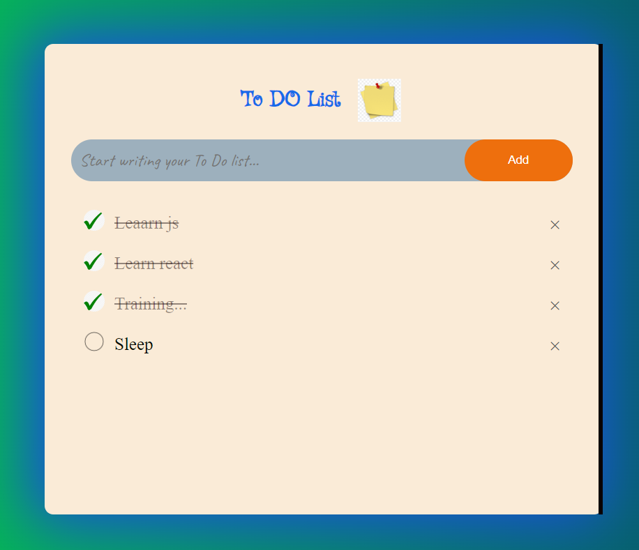

# To-Do List Application

This application is a simple **To-Do List** manager built with HTML, CSS, and JavaScript. It allows users to add, mark, and delete tasks, with data persistence via local storage.

## Features

- **Add Tasks**: Users can input tasks into a text box and add them to the list by pressing Enter or clicking a button.
- **Mark Tasks as Completed**: Clicking on a task toggles its completion status, visually indicating whether it is completed or not.
- **Delete Tasks**: Each task has a delete button (`×`) that allows users to remove it from the list.
- **Data Persistence**: Tasks are saved to `localStorage`, ensuring that they persist across page reloads.

## Usage

1. **Add a Task**: Enter a task in the input box and press Enter or click the "Add" button.
2. **Mark a Task as Completed**: Click on the task to toggle its completion status.
3. **Delete a Task**: Click the delete button (`×`) next to the task to remove it from the list.
4. **Persist Data**: The application automatically saves the list to `localStorage` and reloads it when the page is refreshed.

## Technologies Used

- **HTML**: For the structure of the user interface.
- **CSS**: For styling the task list and input box.
- **JavaScript**: For adding interactivity, handling events, and managing local storage.

## How to Run

1. Clone the repository.
2. Open `index.html` in a web browser to view and interact with the application.

